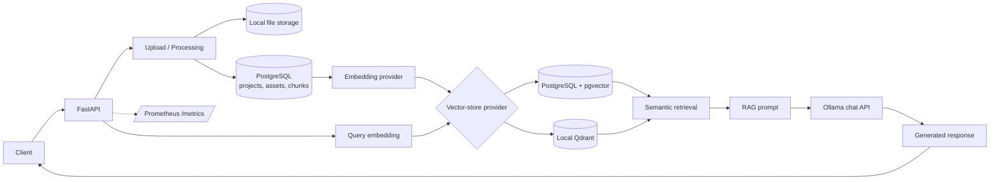

# Mini RAG System

Mini RAG is a project-scoped retrieval-augmented generation backend built with FastAPI. It turns uploaded TXT and PDF documents into searchable knowledge bases through an explicit **Upload → Process → Embed → Index → Retrieve → Generate** workflow.

The implementation combines PostgreSQL persistence, Hugging Face embeddings, pgvector or Qdrant vector storage, Ollama generation, and Prometheus metrics behind a REST API.

## ✨ Features

- Project-scoped document ingestion with configurable upload validation
- TXT and PDF extraction through LangChain Community loaders and PyMuPDF
- Custom newline-aware, character-threshold text chunking
- Hugging Face `sentence-transformers` embeddings
- Semantic indexing and similarity search
- Context-grounded answer generation through Ollama
- PostgreSQL persistence for projects, file assets, and chunks
- Provider implementations for PostgreSQL/pgvector and local Qdrant storage
- Modular factories for embedding, generation, and vector-store providers
- English and Arabic RAG prompt templates with locale fallback
- Prometheus request-count and latency metrics
- FastAPI-generated OpenAPI documentation through Swagger UI and ReDoc

## 🏗️ Architecture



FastAPI coordinates ingestion, processing, indexing, retrieval, and generation. PostgreSQL remains the metadata and chunk store for both vector options, while provider factories select the embedding, generation, and vector-store implementations from environment configuration.

## 🛠️ Tech Stack

| Area | Technologies |
| --- | --- |
| Backend | Python, FastAPI, Uvicorn, Pydantic Settings |
| Document processing | LangChain Community loaders, PyMuPDF, `aiofiles` |
| RAG / LLM | Ollama chat API, locale-aware prompt templates |
| Embeddings | Hugging Face `sentence-transformers`; Ollama embedding provider code |
| Vector database | PostgreSQL + pgvector, Qdrant Client |
| Database | PostgreSQL, SQLAlchemy, `asyncpg`, Alembic |
| Observability | Prometheus Client |
| API documentation | OpenAPI, Swagger UI, ReDoc |

## 🔄 RAG Pipeline

1. **Upload** — The API validates the configured MIME type and maximum size, stores the file under `src/assets/files/<project_id>/`, and records its asset metadata in PostgreSQL.
2. **Document Processing** — `TextLoader` handles TXT files and `PyMuPDFLoader` extracts PDF content.
3. **Chunking** — Extracted text is joined, split on newlines, and accumulated into chunks using the requested character threshold. Chunks are persisted in PostgreSQL.
4. **Embedding & Indexing** — Stored chunks are read in pages, embedded, and inserted into a project collection named `collection_<project_id>`.
5. **Semantic Retrieval** — The query is embedded and compared with indexed vectors; the API returns the nearest chunks and their scores.
6. **Context-Grounded Generation** — Retrieved chunks are formatted with the selected prompt template and sent to Ollama for answer generation.

## 📁 Project Structure

```text
MINI-RAG/
├── docker/                         # Nginx and Prometheus config fragments
├── src/
│   ├── controllers/                # Ingestion, processing, and RAG orchestration
│   ├── helpers/config.py           # Environment-backed settings
│   ├── models/                     # Data access, ORM models, and migrations
│   ├── routes/                     # FastAPI endpoints and request schemas
│   ├── stores/llm/                 # Ollama/Hugging Face providers and prompts
│   ├── stores/vectordb/            # pgvector and Qdrant providers
│   ├── utils/metrics.py            # Prometheus middleware and endpoint
│   ├── .env.example                # Safe configuration template
│   ├── main.py                     # Application wiring and lifecycle
│   └── requirements.txt
├── .gitignore
└── README.md
```

## 🚀 Getting Started

### Prerequisites

- Python 3.12 recommended; the repository was inspected with Python 3.12.7 and does not declare a formal minimum version
- PostgreSQL for project, asset, and chunk persistence
- The PostgreSQL `vector` extension when `VECTOR_DB_BACKEND="PGVECTOR"`
- Ollama and a locally available chat model for RAG answer generation

### 1. Install dependencies

```bash
python -m venv .venv
python -m pip install --upgrade pip
python -m pip install -r src/requirements.txt
```

Activate the environment with `source .venv/bin/activate` on Linux/macOS or `.\.venv\Scripts\Activate.ps1` in PowerShell before installing dependencies.

### 2. Configure the application

```bash
# Linux/macOS
cp src/.env.example src/.env
```

```powershell
# PowerShell
Copy-Item src/.env.example src/.env
```

Edit `src/.env` with the PostgreSQL connection, selected providers, model IDs, embedding dimension, upload limits, and prompt locale. Keep this file private.

### 3. Apply the database migration

From the repository root:

```bash
cd src/models/db_schemes/mini_rag_db
cp alembic.ini.example alembic.ini
# Set sqlalchemy.url in alembic.ini to a synchronous PostgreSQL URL.
alembic upgrade head
cd ../../../..
```

In PowerShell, use `Copy-Item alembic.ini.example alembic.ini` instead of `cp`. The application uses `src/.env`, but Alembic reads its connection URL from the local `alembic.ini`.

### 4. Prepare Ollama and start FastAPI

Pull the model configured by the provided environment example, or replace it with your chosen `GENERATION_MODEL_ID`:

```bash
ollama pull qwen2.5:3b-instruct-q3_k_s
cd src
python -m uvicorn main:app --reload --host 0.0.0.0 --port 8000
```

The API is available at `http://localhost:8000`. Startup requires valid settings and access to the configured PostgreSQL, vector-store, embedding, and generation dependencies.

## 🔌 API Endpoints

| Method | Endpoint | Purpose |
| --- | --- | --- |
| `GET` | `/api/v1/` | Return the configured application name and version |
| `POST` | `/api/v1/data/upload/{project_id}` | Validate and store a TXT or PDF file |
| `POST` | `/api/v1/data/process/{project_id}` | Extract and persist chunks for project files |
| `POST` | `/api/v1/nlp/index/push/{project_id}` | Embed chunks and push them to the vector store |
| `GET` | `/api/v1/nlp/index/info/{project_id}` | Return collection or vector-table information |
| `POST` | `/api/v1/nlp/index/search/{project_id}` | Retrieve semantically similar chunks |
| `POST` | `/api/v1/nlp/index/answer/{project_id}` | Retrieve context and generate a RAG answer |
| `GET` | `/metrics` | Expose Prometheus metrics |

Swagger UI is available at `http://localhost:8000/docs`; ReDoc is available at `/redoc`.

### Example workflow

Upload a document:

```bash
curl -X POST "http://localhost:8000/api/v1/data/upload/1" -F "file=@document.pdf"
```

Process all uploaded project files, then rebuild the project index:

```bash
curl -X POST "http://localhost:8000/api/v1/data/process/1" -H "Content-Type: application/json" -d '{"chunk_size":500,"chunk_overlap":0,"do_reset":1}'
curl -X POST "http://localhost:8000/api/v1/nlp/index/push/1" -H "Content-Type: application/json" -d '{"do_reset":1}'
```

Generate a context-grounded answer:

```bash
curl -X POST "http://localhost:8000/api/v1/nlp/index/answer/1" -H "Content-Type: application/json" -d '{"text":"What does the document say about retrieval?","limit":5}'
```

## 📊 Monitoring

`GET /metrics` exposes Prometheus-format `http_requests_total` and `http_request_duration_seconds` metrics. The repository includes a Prometheus scrape configuration, but it does not provision the referenced services.

## ⚠️ Current Limitations

- Automated tests and CI workflows are not included.
- `chunk_overlap` is accepted by the request schema but is not applied by the active splitter; generated chunks also discard loader metadata.
- The upload response returns an asset database ID, while per-file processing looks up the randomized stored asset name. Omitting `file_id` processes all project files and avoids this mismatch.
- Authentication, authorization, and rate limiting are not implemented.
- Vector providers are not covered by integration tests, and their async contracts still need normalization.
- The Nginx and Prometheus files are configuration fragments; no Dockerfile or Compose definition provides a runnable container deployment.

## 🔮 Future Improvements

- Add unit and integration tests for ingestion, chunking, migrations, retrieval, and provider backends.
- Implement overlapping chunks while preserving source and page metadata.
- Align the upload response identifier with per-file processing.
- Add a complete Docker/Compose development stack.
- Add CI/CD checks for formatting, static analysis, tests, and secret scanning.
